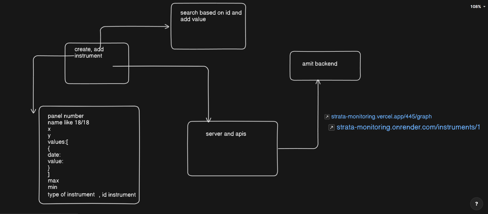

https://strata-monitoring.onrender.com
https://strata-monitoring.vercel.app/
https://strata-monitoring.vercel.app/:id/graph

# app Mind Map
Frontend folder is just for testing actual code is in client backend and server

//backend
http://localhost:3000/project/users/signup
only manager can upload data file
//data assumption 
data must be of this type 
{
  "panelNumber": 1,
  "date": "2025-12-06T08:00:00Z",
  "panelStatus": "completed",
  "pillars": [
    { "pillarNumber": 1, "coordinates": [ { "x": 5, "y": 5 }, { "x": 7, "y": 5 }, { "x": 7, "y": 8 }, { "x": 5, "y": 8 } ], "status": "extracted" },
    { "pillarNumber": 2, "coordinates": [ { "x": 8, "y": 5 }, { "x": 10, "y": 5 }, { "x": 10, "y": 8 }, { "x": 8, "y": 8 } ], "status": "extracted" },
    { "pillarNumber": 3, "coordinates": [ { "x": 11, "y": 5 }, { "x": 13, "y": 5 }, { "x": 13, "y": 8 }, { "x": 11, "y": 8 } ], "status": "extracted" },
    { "pillarNumber": 4, "coordinates": [ { "x": 14, "y": 5 }, { "x": 16, "y": 5 }, { "x": 16, "y": 8 }, { "x": 14, "y": 8 } ], "status": "extracted" },
    { "pillarNumber": 5, "coordinates": [ { "x": 17, "y": 5 }, { "x": 19, "y": 5 }, { "x": 19, "y": 8 }, { "x": 17, "y": 8 } ], "status": "failed" }
  ],
  "instrumentIds": ["15", "16", "17", "18"],
  "notes": "Panel depillaring completed. Monitoring continues on failed pillar."
}
x and y cordinate for all taken from same refrence

